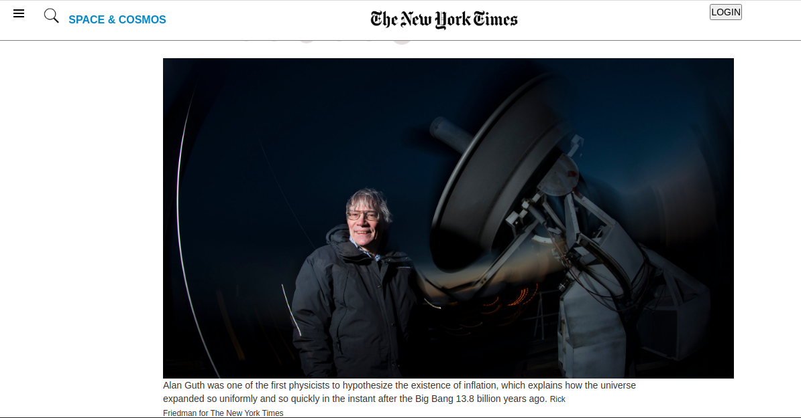

# Project Name

> New_york_times_article page clone with HTML and CSS.

Additional description about the project and its features.

## Built With

- HTML
- CSS

## Live Demo

[Live Demo Link](https://aduda-boaz.github.io/newYork-times)

## Authors

👤 **Boaz Aduda**

- GitHub: [@Aduda-Boaz](https://github.com/Aduda-Boaz)
- Twitter: [@adudaboaz](https://twitter.com/adudaboaz)
- LinkedIn: [LinkedIn](https://linkedin.com/linkedinhandle)

## 🤝 Contributing

Contributions, issues, and feature requests are welcome!

Feel free to check the [issues page](issues/).

## Show your support

Give a ⭐️ if you like this project!

## Acknowledgments

- Microverse Global School for Remote Developers

## 📝 License

This project is [MIT](lic.url) licensed.
